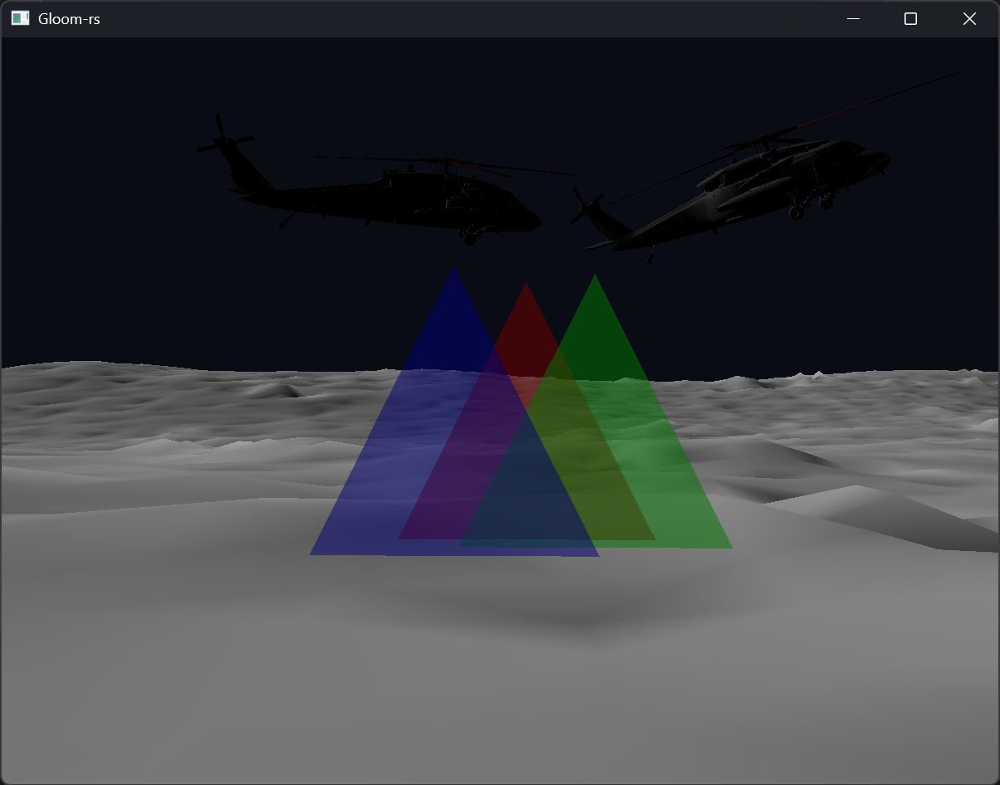
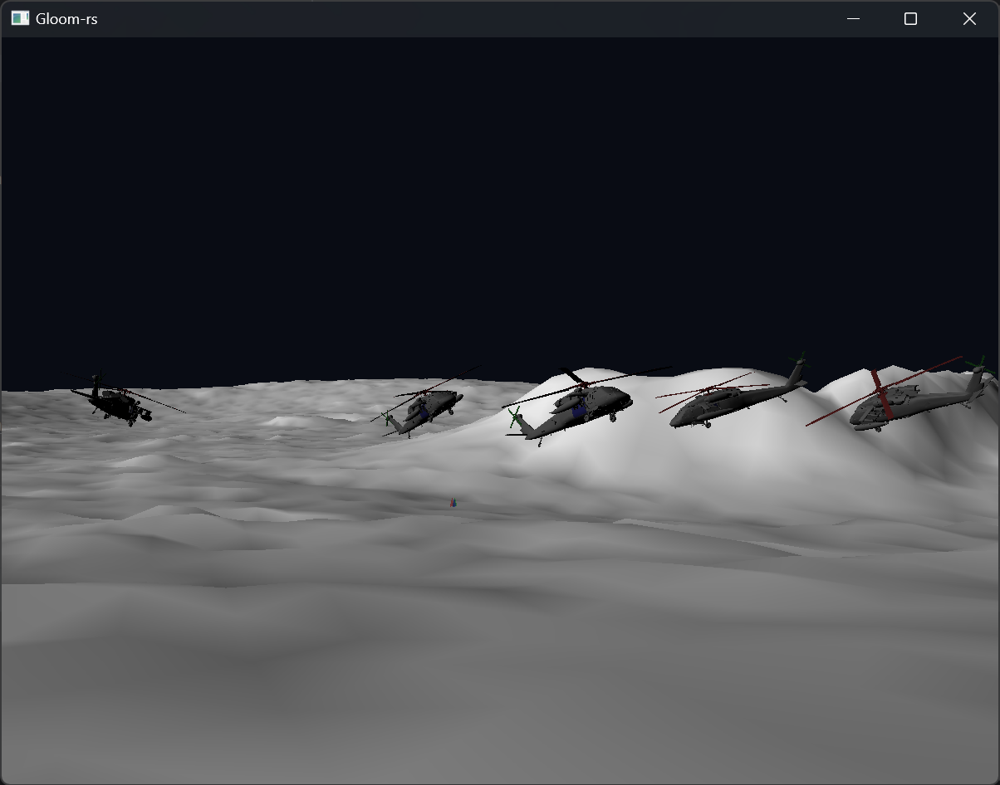

# Computer Graphics 1 Project (TDT4195)

This repository collects all three hand-ins for the **Visual Computing Fundamentals** (Computer Graphics 1) course at NTNU (autumn 2024).  
Together they form a single, cumulative project that starts with drawing a few triangles and ends with a fully animated, lit moon-scene featuring multiple helicopters.

**Tech stack**: Rust + OpenGL 4.0 Core (GLSL), using the [gloom-rs](https://github.com/pbsds/gloom-rs) framework provided by the course.

## Screenshots

  
  

## Requirements

* [x] Draws coloured triangles & wireframes
* [x] Per‑vertex colour interpolation
* [x] Transparent triangles with correct depth sorting & alpha blending
* [x] Perspective projection & free‑fly camera rig
* [x] OBJ mesh loading (lunarsurface & helicopter)
* [x] Scene‑graph with hierarchical transforms
* [x] Basic Lambert lighting (per‑pixel normals)
* [x] Time‑based rotor animation
* [x] Chase camera that locks onto any helicopter
* [x] Helicopter pilot mode with WASD controls
	* Follow a helicopter by pressing `CTRL + num` to select it, then `ALT` to control it with WASD (controls are a bit wonky, but functional)
* [x] Tested on Windows 11 and expected to work on recent Linux distros with OpenGL 4.0+ (untested)

